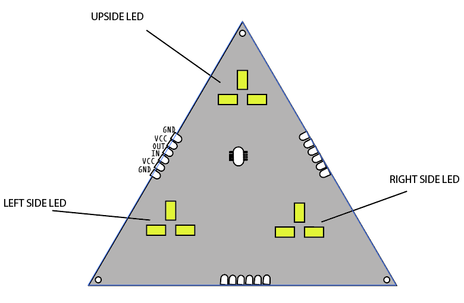

# MicroDome V0 

## Useless Functions 
	- MicroDome::begin() <- Initialize Tiles
	- MicroDome::setTile(Tile_index, LedLevels) with :
	- LedLevels = MicroDome::setLedLevels(Right Side LED Level, Left Side LED Level, Up Side LED Level)
	- Levels values : from 0 to 255 
	- MicroDome::clear()
	

